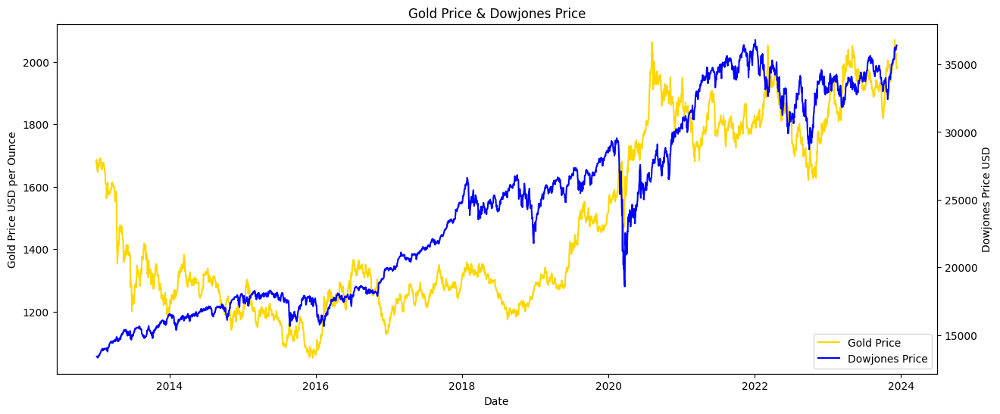
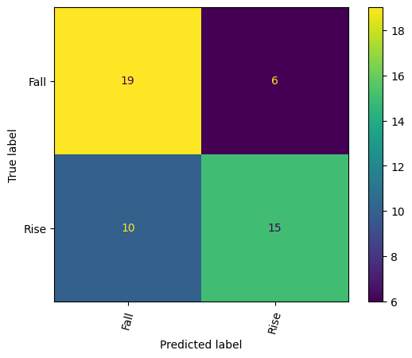

# Capstone: Gold Prediction and other factors

# Problem Statement
The objective is to analyze and determine the key factors or combinations of factors that significantly influence the trends in gold prices. Investigate the relationships and interdependencies among these variables to understand the factors driving changes in gold price trends. The aim is to create a model capable of accurately classifying the future direction of gold prices, thereby providing valuable insights for decision-making and risk management in gold investment strategies.

# Data Dictionary
**Note:** These datasets use same table below

> **Gold Price USD, Crude Oil**

> **Stock Index:** dowjones_data, nasdaq_composite, S&P500

> **Exchange Rate:** USD-THB (Thai), USD-RUB (Russia), USD-AUD(Australia), USD-CHY(Chinese)

| Data Name | Description | Type | Example |
| --------- | ----------- | ---- | ------- |
| Date | YYYY-MM-DD | Datetime | 2019-01-01 |
| Close | Closing Price | Float | 1865.25 |
| Open | Opening Price | Float | 1867.65 | 
| High | Highest Price on current date | Float | 1985.58 |
| Low | Lowest Price in current date | Float | 1828.75 |

> **Unemployment Rate**

| Data Name | Description | Type | Example |
| --------- | ----------- | ---- | ------- |
| Date | YYYY-MM-DD | Datetime | 2019-01-01 |
| UNRATE | unemployment Rate (%) | Float | 7.7 |

> **Federal Interest Rate**

| Data Name | Description | Type | Example |
| --------- | ----------- | ---- | ------- |
| Date | YYYY-MM-DD | Datetime | 2019-01-01 |
| FF | Federal Interest Rate (%) | Float | 5.5 |

# Data Exploratory
**Gold Price Daily & Weekly**

These 2 line graphs display daily and weekly gold price to compare noise data. As you can see that weekly gold price can visualized easily.

**Gold Price and Crude Oil Price**

There is a big drop of crude oil price in early year 2020 because COVID-19 pandemic affect citizens which has to isolate at their residents. Plus, this pandemic affect macroeconomics, so many people invested gold as safe haven to secure their financial assets.

> **Stock Index Features**

**Gold Price and Dow Jones**

**Gold Price and Nasdaq**

**Gold Price and S&P500**

These 3 stock price index are rise gradually with gold price. On the other hand, gold price and these 3 stock price index are inversely relationship that when market stock goes well, gold demand is dropped.

> **Exchange Rate Features**

According to global map, this showed where is the production of gold mines. Thus, I picked the first top 3 of highest gold production which are China, Russia, Australia.

**Gold Price and USD-CNY**

**Gold Price and USD-RUB**

**Gold Price and USD-AUD**

**Gold Price and USD-THB**

**Gold Price and Unemployment rate**

**Gold Price and Federal Interest Rate**

These 2 features can represent the economic situation which can be related to stock index and currency. Early 2020, the line graph has a big change that unemployment rate hit the hike. So that, the Central Bank of US has reduce Federal Interest Rate, so gold price was high demand because uncertain situation.

# Evaluation and Conceptual Understanding
I have devloped models to utilize various algorithms, including `Logistic Regression`, `Random Forest`, and `XGBoost`. My experiments involved feature selection and engineering, and only `XGBoost` with hyperparameter tuning, to achieve optimal results in classifying gold price rise or fall depend on independent features.

## Logistic Regression

## Random Forest

## XGBoost

# Conclusion
**Best Model Output**: 
is `XGBoost` with an accuracy of 0.68 and recall of 0.60.

Feature importance from the `XGBoost` coefficients showed that gold price is predicted correctly which are influenced by xau index (gold mine), USD-CNY, crudeoil price, and Dow Jones.

# Suggestion
On top from conclusion, these features can estimate gold price movement, but investors has to spend time on news. For example, Russian-Ukrain War and COVID-19 Pandemic critically affected on macroeconomics, so gold price has a huge impact after this circumstances. If there are some rumors about 2024 or future prediction, investors should carefully see the reliable news and data. 

# Limitation & Further Works
- The classification and regression model can only predict direction of gold price (fall or rise)
- The gold price data is insufficiency (because it is not daily data)
- COVID-19 outbreak can cause extraordinary movement in many economic indices
- Time Series Analysis (ARIMA, SARIMAX, Prophet, Recurrent Neural Network): Gold holders (who has gold) would like to know `value` of gold in future, which this classification model cannot predict

# Reference
> Gold Price: 
https://www.investing.com/currencies/xau-usd

> XAU (Philadelphia Gold and Silver Index):
https://www.google.com/finance/quote/XAU:INDEXNASDAQ?hl=en

> Gold Mine Production:
https://www.gold.org/goldhub/data/gold-production-by-country

> Stock Index (Dowjones, Nasdaq, S&P500): 
https://www.investing.com/indices/us-30
https://www.investing.com/indices/us-spx-500
https://www.investing.com/indices/nasdaq-composite

> Exchange Rate (USD-THB, USD-CNY, USD-AUD, USD-RUB):
https://www.google.com/finance/quote/USD-CNY?hl=en
https://www.google.com/finance/quote/USD-THB?hl=en
https://www.google.com/finance/quote/USD-AUD?hl=en
https://www.google.com/finance/quote/USD-RUB?hl=en

> Federal Fund:
https://fred.stlouisfed.org/series/FEDFUNDS

> News to support data point:
https://www.ft.com/content/eb8804fe-96e1-4eb0-a9c8-ef4626fbe8f5
